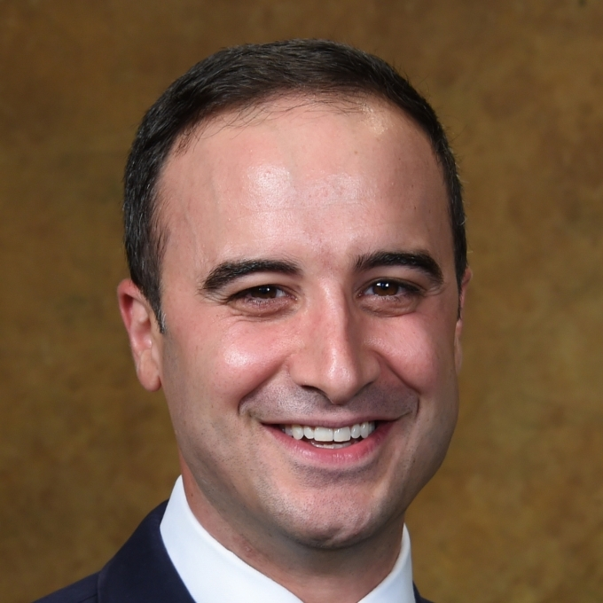
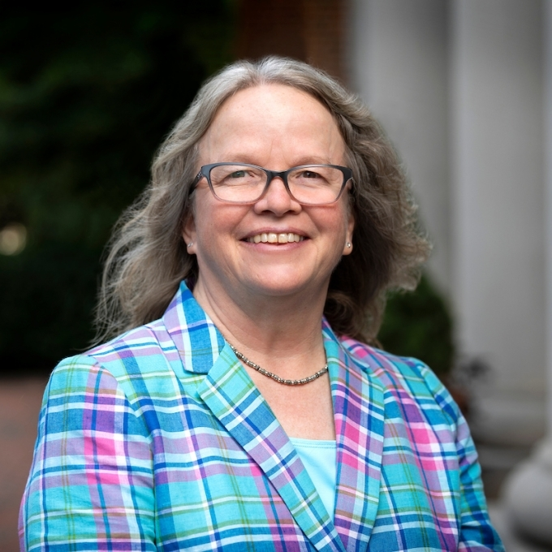
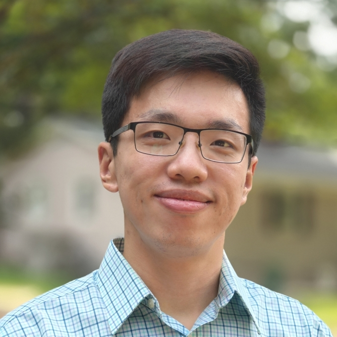
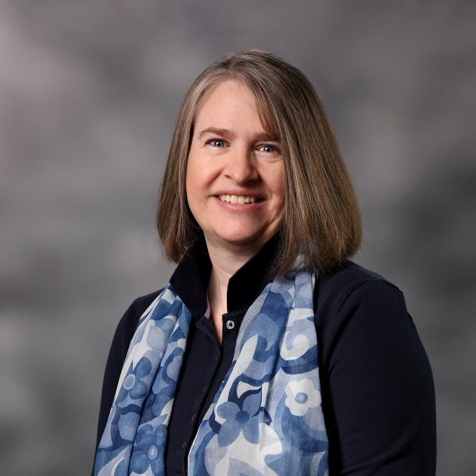
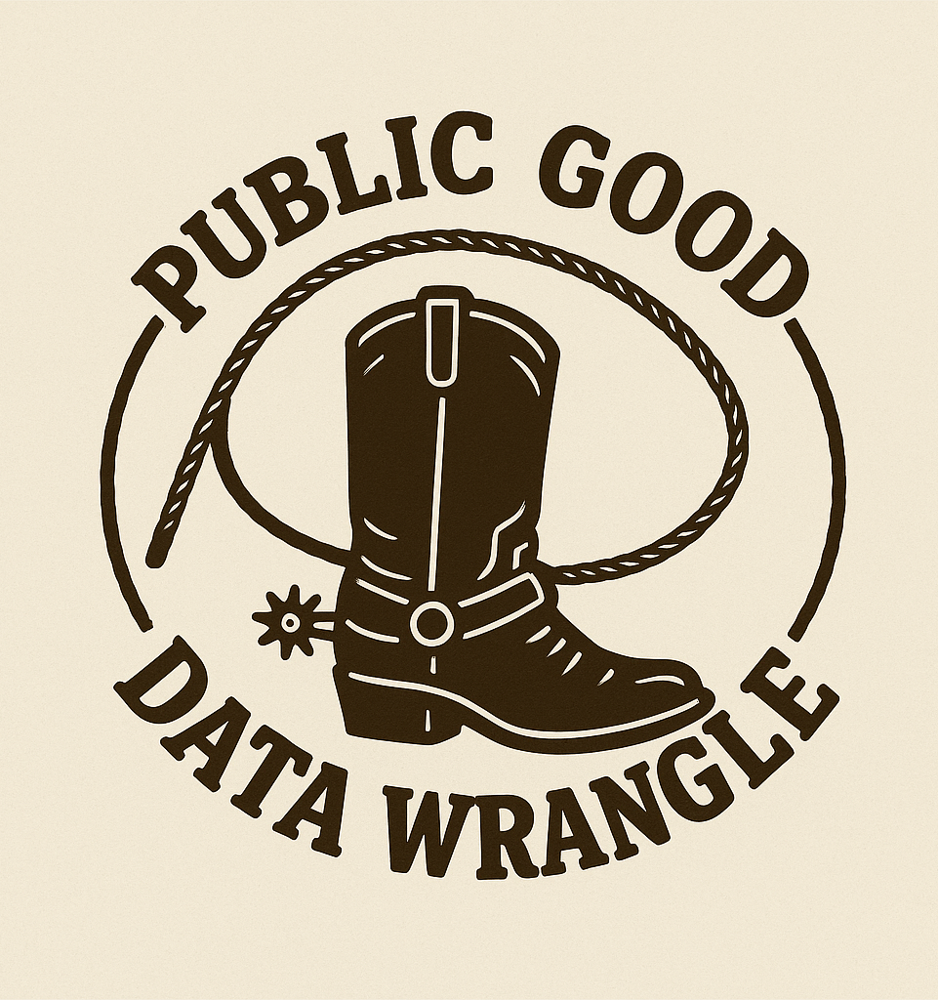
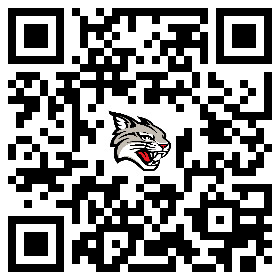
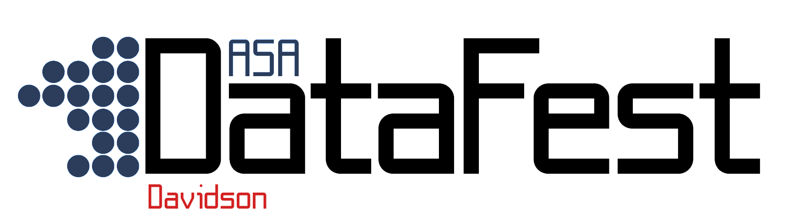
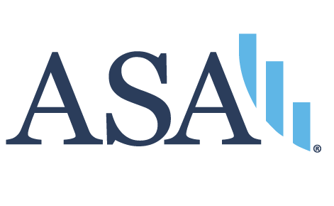
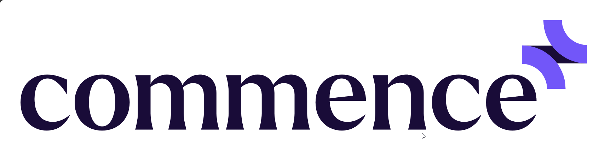
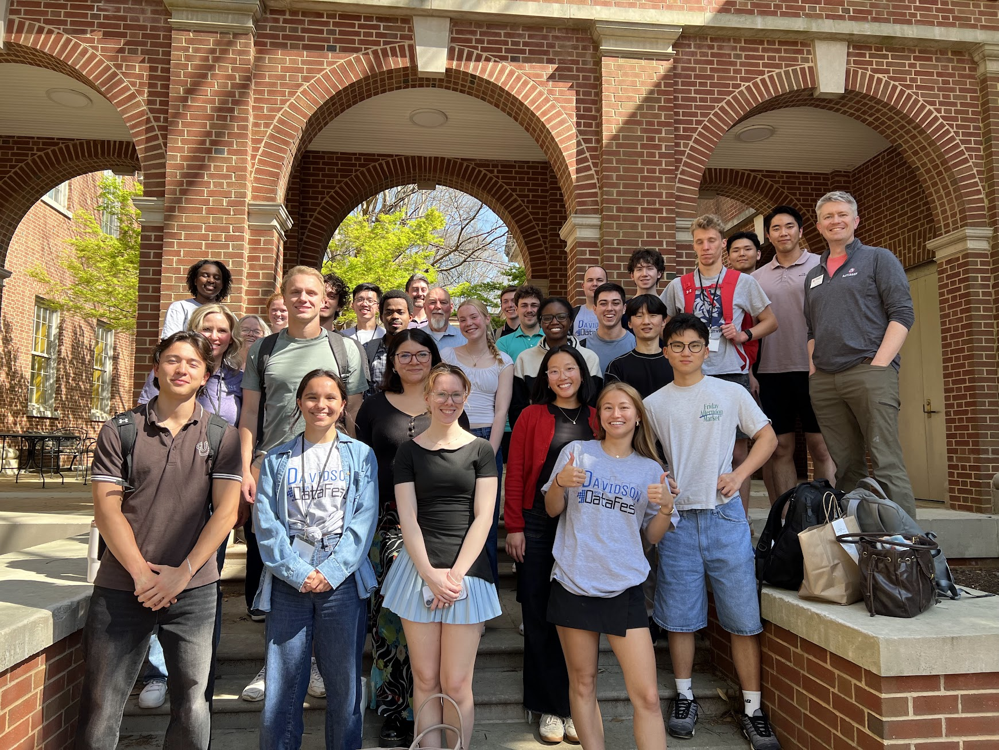

# The Data Science Department

## Department Leadership

::::: {.rows}

:::: {.row}

::: {.column width="25%"}

:::

::: {.column width="75%"}
Dr. Andrew O'Geen

Chair (interim)
:::

::::

:::: {.row}

::: {.column width="25%"}

:::

::: {.column width="75%"}
Dr. Laurie Heyer

Chair (on sabbatical until Fall 2027)
:::

::::

:::::

## Other Data Science Faculty

::::: {.rows}

:::: {.row}

::: {.column width="25%"}

:::

::: {.column width="75%"}
Dr. Kevin Wang

Assistant Professor
:::

::::

:::: {.row}

::: {.column width="25%"}

:::

::: {.column width="75%"}
Prof. Pete Benbow '07

Assistant Professor of the Practice
:::

::::

:::::

## REAL Department Leadership

::::: {.rows}

:::: {.row}

::: {.column width="25%"}

:::

::: {.column width="75%"}
Amber MacIntyre

Departmental Coordinator
:::

::::

:::::

*The real brains behind the operation*

# What is Data Science?

## What is Data Science?

A highly interdisciplinary field that blends **mathematics** with **computer science** to extract useful knowledge from data.

Can be used in a variety of fields, including natural sciences, social sciences, and the humanities.

## What skills might DS teach me?

::::: {.columns}

:::: {.column width="50%"}

::: incremental
- Quantitative research
- Qualitative research
- Exploratory data analysis
- Statistics
- Data visualization
:::

::::

:::: {.column width="50%"}

::: incremental
- Software development
- Data engineering
- Machine learning
- Geospatial analysis
:::

::::

:::::

## Some Data Science courses {.scrollable}

**[Red]{style="color:#d42121;"}** = courses taught by DS core faculty

- **[MAT 105: Intro to Statistics]{style="color:#d42121;"}**
- **[CSC 110: Data Science & Society]{style="color:#d42121;"}**
- CSC 121: Programming & Problem-Solving
- **[DAT 153: Database Programming]{style="color:#d42121;"}**
- SOC 201: Social Statistics
- **[DAT 205: Statistical Linear Models]{style="color:#d42121;"}**
- ECO 205: Econometrics
- MAT 210: Mathematical Modeling
- BIO 240: Biostatistics
- PHY 240: Computational Physics
- ENV 247: Intro to Interdisciplinary GIS
- EDU 291: Data in Education
- **[DAT 305: Bayesian Statistics]{style="color:#d42121;"}**
- BIO 309: Genomics
- ECO 316: Computational Economics
- DIG 320: Technology, Knowledge, & Wisdom
- **[DAT 342: Data Engineering]{style="color:#d42121;"}**
- CSC 362: Data Visualization
- CSC 374: Deep Learning

# Data Science Events

## Public Good Data Wrangle

:::: {.columns}

::: {.column width="35%"}

:::

::: {.column width="65%"}

- Annual collaboration with the [Martin Institute for Public Good](https://apublicgood.com)
- Happening **October 3, 2026!**
- Student teams have 12 hours to investigate a **public policy issue** through analysis and visualization, and present their findings
- Awards! Free food!

:::

::::

## Public Good Data Wrangle

:::: {.columns}

::: {.column width="30%"}

:::

::: {.column width="70%"}

Register today by scanning the QR code or go to [go.davidson.edu/datawrangle](https://go.davidson.edu/datawrangle)

:::

::::

## DataFest

:::: {.columns}

::: {.column width="40%"}

:::

::: {.column width="60%"}

- Sponsored by the [American Statistical Association (ASA)](https://amstat.org)
- **Nationwide** data science hackathon every spring semester
- Registration opens in **January**
- Student teams have 48 hours to analyze, visualize, and present their findings on an ASA dataset
- More awards! More free food!

:::

::::

## DataFest Sponsors

Local companies sponsor DataFest and provide mentorship and networking opportunities!

:::::: {.columns}
::::: {.column}
:::: {.rows}
::: {.row}

:::
::: {.row}

:::
:::: 
:::::
::::: {.column}
:::: {.rows}
::: {.row}

:::
::: {.row}
:::
::::
:::::
::::::

---------------------------

# Majoring in Data Science

## Yes, you can major in Data Science!

- Data Science is currently a **student-designed major** via the Center for Interdisciplinary Studies (CIS)
- Meet with the CIS Director, Dr. Britta Crandall, during first-year spring or sophomore fall semester
- Work with one of our faculty to build a roadmap of the courses you want to take[^1]
- Apply, and hope you get accepted!

[^1]: We can provide you with sample roadmaps from previous DS students

## What does the major look like?

- Use your roadmap to pick the courses you want to take[^2]
- Senior year: either capstone project (1 semester) or thesis (2 semesters)[^3]

[^2]: This is flexible; we cannot guarantee you will get into a particular course, or that it will even be offered
[^3]: Thesis is required to be considered for Honors in Data Science

## A few words of caution

You need to keep the following in mind:

- Students must apply by **February** of their **sophomore** year
- There is a limited number of slots[^4]
- "It is strongly recommended that students interested in pursuing a CIS major meet with the **Director** sometime during their first-year spring or sophomore fall semester."[^5]

[^4]: CIS major advisors are only permitted to advise 2 majors per graduating class.
[^5]: [Center for Interdisciplinary Studies](https://catalog.davidson.edu/preview_program.php?catoid=28&poid=1794)

# Minoring in Data Science

## Data Science interdisciplinary minor

The IDAT minor requires you to take **6 courses** from at least 3 different subjects (CSC, MAT, DAT, PHY, BIO, etc.)[^6]

- 1 **statistics** course
- 1 **programming** course
- 4 **elective** courses

Must apply through the Data Science department website

[^6]: Only two courses can jointly count for a student’s major and the data science minor

# A word from one of our majors

Taehee Kim '27

# Questions?

Email datasci@davidson.edu